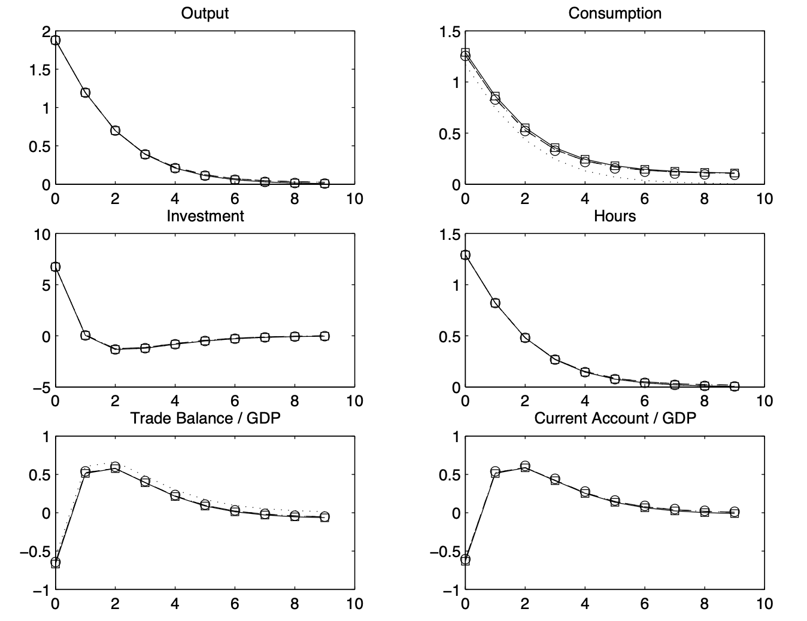
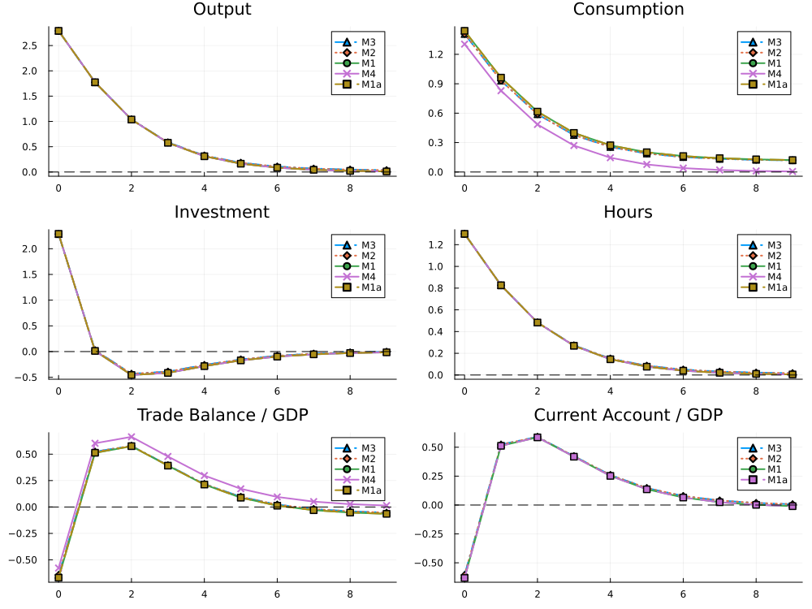

::: callout-note
## Collegio Carlo Alberto Replication Project

This report was created as part of the assessment for the [Computational Economics Course](https://floswald.github.io/CompEcon/) in the PhD program at Collegio Carlo Alberto taught by Florian Oswald.
:::

# Introduction

This project replicates the results of:

> Schmitt-Grohé, S. and Uribe, M. (2003),  
> *Closing Small Open Economy Models*,  
> Journal of International Economics, 61, 163–185.

The paper studies alternative methods for closing small open economy models and compares their quantitative implications for business cycle dynamics and second moments.

The project reproduces the main model specifications presented in the paper using Julia and the `MacroModelling.jl` package. In particular, we replicate the impulse response functions and unconditional second moments for Models 1 to 4.

In addition, we extend the original analysis by implementing Model 5 under perfect foresight and studying the effects of alternative terminal conditions on the transitional dynamics of the economy.

The implementation is partly based on the Dynare replication files provided by Johannes Pfeifer:
<https://github.com/JohannesPfeifer/DSGE_mod/tree/master/SGU_2003>

# High Level Description of Computational Problem in Paper

## Models 1–4

The paper studies small open economy DSGE models under different assumptions regarding the mechanism used to induce stationarity in foreign debt dynamics.

For Models 1 to 4, the economy is subject to stochastic productivity shocks of the form:

$$
a_t = \rho a_{t-1} + \sigma \varepsilon_t
$$

where $begin:math:text$a\_t$end:math:text$ denotes total factor productivity and $begin:math:text$\\varepsilon\_t \\sim \\mathcal\{N\}\(0\,1\)$end:math:text$.

Households solve an intertemporal optimization problem subject to a budget constraint and capital accumulation dynamics. The equilibrium conditions include Euler equations such as:

$$
\lambda_t = \beta (1+r_t)\mathbb{E}_t[\lambda_{t+1}]
$$

together with labor supply conditions and the resource constraint of the economy.

From a computational perspective, the problem consists of:

- computing the deterministic steady state;
- linearizing the equilibrium conditions around steady state;
- solving the resulting rational expectations system;
- simulating the model after a productivity shock;
- computing impulse response functions and unconditional second moments.

In our replication, Models 1 to 4 are implemented in Julia using the `MacroModelling.jl` package. The package symbolically parses the DSGE system and computes a first-order perturbation approximation around the steady state. The resulting linearized model is then used to generate impulse response functions and simulated moments.

The implementation closely follows the Dynare replication files by Johannes Pfeifer, which were used as a benchmark for calibration choices, shock normalization, and quantitative validation of the results.

## Model 5: Perfect Foresight Computation

Unlike the previous models, Model 5 does not include a mechanism that induces stationarity in foreign debt. As a result, standard perturbation methods around a unique stochastic steady state are not appropriate.

To study the dynamics of the economy after a productivity shock, we instead solve the model under perfect foresight over a finite horizon.

The economy is initialized at the deterministic steady state and agents are assumed to perfectly anticipate the future path of the economy after the shock realization. The equilibrium dynamics are described by a nonlinear system including equations such as:

$$
c_t + i_t + d_t = y_t + (1+r)d_{t-1}
$$

and the capital accumulation equation:

$$
k_{t+1} = (1-\delta)k_t + i_t
$$

The transition path is solved simultaneously over all periods of the simulation horizon. In practice, the unknown paths of consumption, investment, capital, labor, debt, and marginal utility are stacked into a large nonlinear system.

The nonlinear system is solved numerically using the `NLsolve.jl` package.

Since Model 5 is non-stationary, the finite-horizon solution depends on the terminal condition imposed at the end of the simulation. We compare three alternative terminal conditions:

1. free terminal debt drift;

$$
d_T = d_{T-1}
$$

2. debt converging to steady state;

$$
d_T = \bar d
$$

3. convergence of capital and marginal utility to steady state;

$$
k_{T+1} = k^{ss}, \qquad \lambda_T = \lambda^{ss}
$$

The comparison highlights how terminal conditions mainly affect intertemporal variables such as debt dynamics, consumption, and the current account, while real variables such as output and hours remain relatively similar across specifications.

# Our Computational Setup

The project was developed and executed locally using both Julia and Dynare.

The replication of Models 1 to 4 was implemented in Julia using the `MacroModelling.jl` package, while the original Dynare replication files by Johannes Pfeifer were used as a benchmark to validate impulse response functions, calibrations, and moment computations.

Model 5 was implemented entirely in Julia and solved under perfect foresight using nonlinear root-finding methods provided by `NLsolve.jl`.

The computations were run on:

- Apple MacBook Air
- Apple Silicon M2 and M4 architectures
- macOS environment

The main software and packages used in the project are:

- Julia
- Dynare
- MacroModelling.jl
- NLsolve.jl
- DataFrames.jl
- CSV.jl
- Plots.jl

All package versions and dependencies are fully documented in the `Project.toml` and `Manifest.toml` files included in the repository, ensuring computational reproducibility.
# Replication Results

# Results

## Models 1–4: Replication

For Models 1–4, we reproduce the main impulse response functions and second moments using `MacroModelling.jl`.

### Original IRFs in the paper

Note. Solid line: Endogenous discount factor model; Squares: Endogenous discount factor model without internalization; Dashed line: Debt-elastic interest rate model; Dash-dotted line: Portfolio adjustment cost model; Dotted line: complete asset markets model; Circles: Model without stationarity inducing elements.

### Our extimated IRFs

### Table of moments in the original paper

| Moment | Model 1 | Model 1a | Model 2 | Model 3 | Model 4 |
|---|---:|---:|---:|---:|---:|
| **Volatilities** ||||| |
| std($y_t$) | 3.1 | 3.1 | 3.1 | 3.1 | 3.1 |
| std($c_t$) | 2.3 | 2.3 | 2.7 | 2.7 | 1.9 |
| std($i_t$) | 9.1 | 9.1 | 9.0 | 9.0 | 9.1 |
| std($h_t$) | 2.1 | 2.1 | 2.1 | 2.1 | 2.1 |
| std($tb_t/y_t$) | 1.5 | 1.5 | 1.8 | 1.8 | 1.6 |
| std($ca_t/y_t$) | 1.5 | 1.5 | 1.5 | 1.5 |  |
| **Serial Correlations** ||||| |
| corr($y_t,y_{t-1}$) | 0.61 | 0.61 | 0.62 | 0.62 | 0.61 |
| corr($c_t,c_{t-1}$) | 0.70 | 0.70 | 0.78 | 0.78 | 0.61 |
| corr($i_t,i_{t-1}$) | 0.07 | 0.07 | 0.069 | 0.069 | 0.07 |
| corr($h_t,h_{t-1}$) | 0.61 | 0.61 | 0.62 | 0.62 | 0.61 |
| corr($tb_t/y_t,(tb/y)_{t-1}$) | 0.33 | 0.32 | 0.51 | 0.50 | 0.39 |
| corr($ca_t/y_t,(ca/y)_{t-1}$) | 0.30 | 0.30 | 0.32 | 0.32 |  |
| **Correlations with Output** ||||| |
| corr($c_t,y_t$) | 0.94 | 0.94 | 0.84 | 0.85 | 1.00 |
| corr($i_t,y_t$) | 0.66 | 0.66 | 0.67 | 0.67 | 0.66 |
| corr($h_t,y_t$) | 1.00 | 1.00 | 1.00 | 1.00 | 1.00 |
| corr($tb_t/y_t,y_t$) | -0.012 | -0.013 | -0.044 | -0.043 | 0.13 |
| corr($ca_t/y_t,y_t$) | 0.026 | 0.025 | 0.050 | 0.051 |  |

### Our table of moments

| Moment | Model 1 | Model 1a | Model 2 | Model 3 | Model 4 |
|---|---:|---:|---:|---:|---:|
| **Volatilities** ||||| |
| std($y_t$) | 3.1 | 3.1 | 3.1 | 3.1 | 3.1 |
| std($c_t$) | 2.4 | 2.3 | 2.7 | 2.7 | 1.9 |
| std($i_t$) | 9.1 | 9.1 | 9.0 | 9.0 | 9.1 |
| std($h_t$) | 2.1 | 2.1 | 2.1 | 2.1 | 2.1 |
| std($tb_t/y_t$) | 1.5 | 1.5 | 1.8 | 1.8 | 1.6 |
| std($ca_t/y_t$) | 1.5 | 1.5 | 1.5 | 1.5 |  |
| **Serial Correlations** ||||| |
| corr($y_t,y_{t-1}$) | 0.6 | 0.6 | 0.6 | 0.6 | 0.6 |
| corr($c_t,c_{t-1}$) | 0.7 | 0.7 | 0.8 | 0.8 | 0.6 |
| corr($i_t,i_{t-1}$) | 0.1 | 0.1 | 0.1 | 0.1 | 0.1 |
| corr($h_t,h_{t-1}$) | 0.6 | 0.6 | 0.6 | 0.6 | 0.6 |
| corr($tb_t/y_t,(tb/y)_{t-1}$) | 0.3 | 0.3 | 0.5 | 0.5 | 0.4 |
| corr($ca_t/y_t,(ca/y)_{t-1}$) | 0.3 | 0.3 | 0.3 | 0.3 |  |
| **Correlations with Output** ||||| |
| corr($c_t,y_t$) | 0.9 | 0.9 | 0.8 | 0.9 | 1.0 |
| corr($i_t,y_t$) | 0.7 | 0.7 | 0.7 | 0.7 | 0.7 |
| corr($h_t,y_t$) | 1.0 | 1.0 | 1.0 | 1.0 | 1.0 |
| corr($tb_t/y_t,y_t$) | -0.0 | -0.0 | -0.0 | -0.0 | 0.1 |
| corr($ca_t/y_t,y_t$) | 0.0 | 0.0 | 0.1 | 0.1 |  |

## Model 5: Extension

Unlike Models 1 to 4, Model 5 does not include a mechanism that induces stationarity in foreign debt dynamics. As a result, the model cannot be solved using standard local perturbation methods around a unique stochastic steady state.

To study the dynamics of the economy after a productivity shock, we instead solve the model under perfect foresight over a finite horizon.

### Perfect Foresight Setup

The economy is initialized at the deterministic steady state and is hit by a temporary productivity shock of the form:

$$
a_t = \rho a_{t-1} + \sigma \varepsilon_t
$$

Under perfect foresight, agents are assumed to know the entire future path of the shock and choose consumption, investment, labor, and borrowing optimally over the transition.

The equilibrium dynamics are characterized by a nonlinear system including:

- the resource constraint,

$$
c_t + i_t + d_t = y_t + (1+r)d_{t-1}
$$

- the capital accumulation equation,

$$
k_{t+1} = (1-\delta)k_t + i_t
$$

- and the Euler equation,

$$
\lambda_t = \beta (1+r)\lambda_{t+1}
$$

together with the remaining equilibrium conditions of the model.

### Numerical Solution

The transition path is solved over a finite horizon $T$. All equilibrium conditions for every period are stacked into a large nonlinear system.

The unknown variables include the full paths of:

- consumption;
- investment;
- capital;
- labor;
- foreign debt;
- marginal utility.

The nonlinear system is solved numerically using the `NLsolve.jl` package.

### Terminal Conditions

Since Model 5 is non-stationary, the finite-horizon solution depends on the terminal condition imposed at the end of the simulation horizon.

We compare three alternative terminal assumptions:

1. **Free terminal debt drift**

$$
d_T = d_{T-1}
$$

2. **Debt converges to steady state**

$$
d_T = \bar d
$$

3. **Capital and marginal utility converge to steady state**

$$
k_{T+1} = k^{ss}, \qquad \lambda_T = \lambda^{ss}
$$