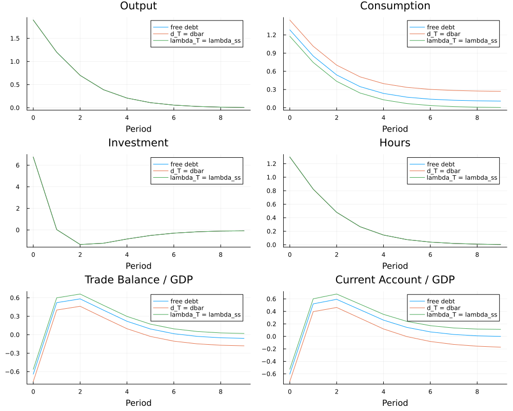

::: callout-note
## Collegio Carlo Alberto Replication Project

This report was created as part of the assessment for the [Computational Economics Course](https://floswald.github.io/CompEcon/) in the PhD program at Collegio Carlo Alberto taught by Florian Oswald.
:::

# Introduction

This project replicates the results of:

> Schmitt-Grohé, S. and Uribe, M. (2003),  
> *Closing Small Open Economy Models*,  
> Journal of International Economics, 61, 163–185.

The paper studies alternative methods for closing small open economy models and compares their quantitative implications for business cycle dynamics and second moments.

The project reproduces the main model specifications presented in the paper using Julia and the `MacroModelling.jl` package. In particular, we replicate the impulse response functions and unconditional second moments for Models 1 to 4.

In addition, we extend the original analysis by implementing Model 5 under perfect foresight and studying the effects of alternative terminal conditions on the transitional dynamics of the economy.

The implementation is partly based on the Dynare replication files provided by Johannes Pfeifer:
<https://github.com/JohannesPfeifer/DSGE_mod/tree/master/SGU_2003>


# High Level Description of Computational Problem in Paper

The paper studies alternative methods for closing small open economy models in the presence of incomplete international financial markets. The main computational task consists of solving and simulating a set of dynamic stochastic general equilibrium (DSGE) models under different assumptions regarding the stationarity-inducing mechanism for foreign debt.

For Models 1 to 4, the paper analyzes stochastic small open economy models subject to productivity shocks:

$$
a_t = \rho a_{t-1} + \sigma \varepsilon_t
$$

where $a_t$ denotes total factor productivity and $\varepsilon_t \sim \mathcal{N}(0,1)$.

The representative household solves an intertemporal optimization problem with standard Euler equations of the form:

$$
\lambda_t = \beta (1+r_t)\mathbb{E}_t[\lambda_{t+1}]
$$

combined with intratemporal optimality conditions for labor supply and capital accumulation.

The computational problem for these models involves:

- computing the deterministic steady state;
- obtaining a first-order perturbation approximation around the steady state;
- solving the resulting linear rational expectations system;
- simulating the model dynamics;
- generating impulse response functions (IRFs);
- computing unconditional second moments such as standard deviations, correlations, and autocorrelations.

In our replication, Models 1 to 4 are implemented in Julia using the `MacroModelling.jl` package, which provides symbolic model parsing, automatic differentiation, perturbation-based solution methods, and simulation tools for DSGE models. The implementation reproduces the calibration and normalization conventions used in the original Dynare replication files by Johannes Pfeifer.

The extension developed in this project concerns Model 5, which is solved under perfect foresight rather than perturbation methods. In this case, the computational problem becomes a nonlinear transition-path problem over a finite horizon. The economy is initialized with a temporary productivity shock, and the entire transition path is solved simultaneously subject to equilibrium conditions and terminal restrictions. 

Different terminal conditions are imposed to close the finite-horizon problem, including:

- free terminal debt drift;
- convergence of debt toward its steady-state value;
- convergence of shadow prices and capital toward steady state.

The nonlinear system is solved numerically using `NLsolve.jl`. After computing the transition paths, we generate perfect-foresight impulse response functions and compare how alternative terminal conditions affect the dynamics of consumption, external balances, and debt accumulation.

# Our Computational Setup

The project was developed and executed locally using both Julia and Dynare.

The replication of Models 1 to 4 was implemented in Julia using the `MacroModelling.jl` package, while the original Dynare replication files by Johannes Pfeifer were used as a benchmark to validate impulse response functions, calibrations, and moment computations.

Model 5 was implemented entirely in Julia and solved under perfect foresight using nonlinear root-finding methods provided by `NLsolve.jl`.

The computations were run on:

- Apple MacBook Air
- Apple Silicon M2 and M4 architectures
- macOS environment

The main software and packages used in the project are:

- Julia
- Dynare
- MacroModelling.jl
- NLsolve.jl
- DataFrames.jl
- CSV.jl
- Plots.jl

All package versions and dependencies are fully documented in the `Project.toml` and `Manifest.toml` files included in the repository, ensuring computational reproducibility.
# Replication Results

# Replication

## Models 1–4

For Models 1–4, we reproduce the main impulse response functions and second moments using `MacroModelling.jl`.

Original irfs in the paper


Our extimated irfs:


## Model 5 Extension

Model 5 is non-stationary because there is no mechanism that pins down the long-run level of foreign debt.

We solve Model 5 using a nonlinear perfect-foresight method. Since the model is non-stationary, the solution depends on the terminal condition imposed on debt or marginal utility.

We compare three terminal conditions:

1. zero terminal debt drift: $begin:math:text$d\_T \= d\_\{T\-1\}$end:math:text$;
2. debt forced back to steady state: $begin:math:text$d\_T \= \\bar d$end:math:text$;
3. capital and marginal utility returned to steady state: $begin:math:text$k\_\{T\+1\}\=k\^\{ss\}$end:math:text$, $begin:math:text$\\lambda\_T\=\\lambda\^\{ss\}$end:math:text$.

# Figures

## Model 5 Perfect-Foresight IRFs

Place the figure in:

```text
images/model5_pf_irfs.png
```

Then it appears here:



# Discussion

The terminal condition has limited effects on real variables such as output, hours, and investment, which are mainly driven by the productivity shock and intratemporal optimality conditions.

The effects are stronger for consumption, the trade balance, the current account, and foreign debt, because these variables are directly linked to the intertemporal allocation of resources and the non-stationary foreign asset position.

This illustrates the key lesson of Schmitt-Grohé and Uribe (2003): small open economy models require a closure device to obtain stationary dynamics.

# Conclusion

The project successfully replicates Models 1–4 and extends the analysis of Model 5 by showing how alternative terminal conditions affect perfect-foresight transition dynamics in a non-stationary small open economy model.